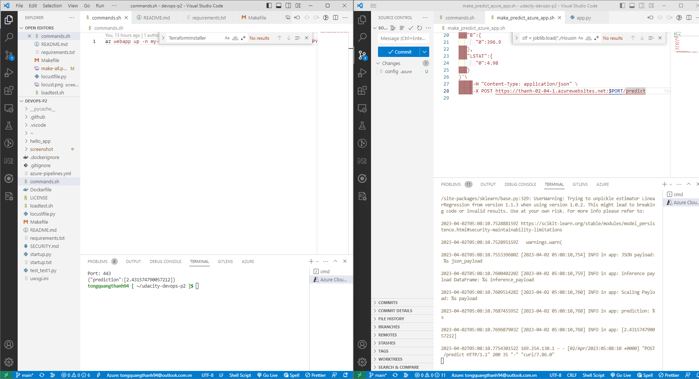

# Overview
This project provide to end-user a website so they can know price of house in Boston base on some criteria

## Project Plan
[Trello board](https://trello.com/b/oLMfbpkO/udacity-devops-project-2)

[Link to a spreadsheet that includes the original and final project plan](https://docs.google.com/spreadsheets/d/1iSIYTZobpSEuvlftq8v8E6Kno3uq63vdYjb32dvm6jk/edit#gid=1348135932)

# Instructions

### Architectural Diagram


### Instructions

* Enter to Azure Portal with your Account and open a Azure Cloud shell (use Bash)

> If you are not created one, just follow the first creation and wait a seconds to get your Cloud Shell.

* First of all set up SSH Keys in your azure cloud shell, add the `id_rsa.pub` key to your GitHub repo ( ssh keys)  and then clone the project there.

```sh
ssh-keygen -t rsa
 cat ~/.ssh/id_rsa.pub
```

Project cloned to Azure cloud shell


* Project Scaffolding (files):

| Plugin | README |
| ------ | ------ |
| Makefile | to create shortcuts to build, test, and deploy a project|
| requirements.txt| to list what packages a project needs |
| hello.py | a basic python app |
| test_hello.py | the test python file to above app|

Move to folder cloned
```sh
cd devops-p2
```

 Create a virtual environment for your application.

```sh
python3 -m venv ~/.myvenv
source ~/.myvenv/bin/activate
```

* Run `make all` which will install, lint, and test code

```sh
make all
```


Result on github action


### Azure DevOps Pipelines Architectural Diagram

* Architectural Diagram


* Go to Azure Devops page and sign in it, create a new Project inside your organization (if you don't have an organization create one first).

* In your new Project in Azure DevOps, go to Project Settings and create a new `Pipeline --> Service Connection` as is explained on the YouTube video link  below (Service Connection must be of Type Azure Resource Manager)

> Note: Name your Service Connection `myServiceConnection`

* Create the webapp deploying the code from the local workspace to Azure app Service (using Plan B1) with this command:

```sh
az webapp up -n <name of webapp> --location westus --sku B1
```


>Note 1: Your service URL  will be something like this : `https://<name of webapp>.azurewebsites.net/`
>Note 2: If you don't choose the sku, the default will be `P1V2(Premium V2 Small)` (brings more costs associated)
>Note 3 : the name of your app must be unique!!!
>Note 4: This operation can take a while to complete ...

* In  your new Project in Azure DevOps, go to Pipelines -->New Pipeline --> GitHub --> Select Your Repo --> select `an Existing YAML file`


> Choose the `main` branch and the file named `azure-pipelines.yml` as is showed on the figure below
> Update the `azure-pipelines.yml` with the name of your webapp and your Service connection point (Check YouTube video for a detailed explanation)
> Modifications are at variables webAppName & environmentName too!!!


* Choose Run Pipeline and your Azure DevOps Pipeline is going to start to be deployed with all his stages (in this case 2: Build & deploy)

* Check that the webapp is running opening his URL, example:

```sh
https://<app-name>.azurewebsites.net/
```


Remaining screenshots can be checked in the screenshot folder.

* Running Azure App Service from Azure Pipelines automatic deployment


* Running load test by locust
```sh
loadtest.sh
```


* Update the file `make_predict_azure_app.sh` with the webapp service end point
* When the Azure DevOps pipeline is successfully deployed, then its time to make a prediction on our webapp (running in Azure App Service):

```sh
./make_predict_azure_app.sh
```

Answer:

```sh
Port: 443
{"prediction":[2.431574790057212]}
```



## Enhancements
Add more case on implementation.
Provide ability for user to select prediction model.

## Demo 
https://youtu.be/0m36MHcrBu8


